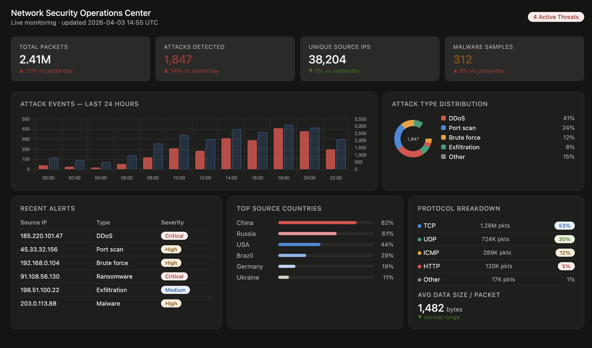

# Network Security Operations Center Dashboard

A responsive, single-page **Network Security Operations Center (SOC) Dashboard** built with HTML, CSS, and Chart.js. Designed for real-time network monitoring and threat visualization.

🔗 **Live Demo:** [View Dashboard]((https://vk2004.github.io/network-security-dashboard/))

---

## 📸 Preview



---

## ✨ Features

- **Key Metrics Panel** — Total packets, attacks detected, unique source IPs, and malware samples at a glance
- **24-Hour Attack Timeline** — Dual-axis bar chart correlating traffic volume with attack events
- **Attack Type Distribution** — Donut chart breaking down DDoS, port scans, brute force, exfiltration, and more
- **Recent Alerts Table** — Live feed of flagged source IPs with attack type and severity classification
- **Top Source Countries** — Proportional bar visualization of attack origin countries
- **Protocol Breakdown** — Per-protocol packet counts (TCP, UDP, ICMP, HTTP, Other)
- **Dark mode support** — Automatically adapts to the user's system preference
- **Fully responsive** — Works on desktop, tablet, and mobile

---

## 🗂️ Dataset Format

This dashboard is designed to consume network monitoring data in the following record schema:

| Field | Description |
|---|---|
| `ID` | Unique record identifier |
| `Timestamp` | Time of capture (Unix or ISO 8601) |
| `Date` | Human-readable date |
| `Source IP` | Originating IP address |
| `Destination IP` | Target IP address |
| `Packet Data Size` | Size of the packet payload in bytes |
| `Protocol` | Network protocol (TCP, UDP, ICMP, HTTP, etc.) |
| `Country` | Geographic origin of source IP |
| `Attack Type` | Detected attack category (null if benign) |
| `Malware Type` | Detected malware family (null if none) |

---

## 🛠️ Tech Stack

| Technology | Purpose |
|---|---|
| HTML5 / CSS3 | Structure and styling |
| [Chart.js 4.4.1](https://www.chartjs.org/) | Interactive timeline chart |
| CSS Custom Properties | Theming and dark mode |
| CSS Grid | Responsive layout |

No build tools or npm required — entirely static.

---

## 🚀 Getting Started

### View locally

```bash
git clone https://github.com/YOUR-USERNAME/network-security-dashboard.git
cd network-security-dashboard
# Open in browser
open index.html
```

Or simply open `index.html` directly in any modern browser.

### Deploy to GitHub Pages

See [DEPLOYMENT.md](DEPLOYMENT.md) for step-by-step instructions.

---

## 📁 Repository Structure

```
network-security-dashboard/
├── index.html          # Main dashboard file
├── README.md           # Project documentation
├── DEPLOYMENT.md       # GitHub Pages deployment guide
├── CONTRIBUTING.md     # Contribution guidelines
├── LICENSE             # MIT License
└── .gitignore          # Git ignore rules
```

---

## 📄 License

This project is licensed under the **MIT License** — see [LICENSE](LICENSE) for details.

---

## 🙌 Acknowledgements

- [Chart.js](https://www.chartjs.org/) for the charting library
- Inspired by real-world SOC monitoring interfaces
